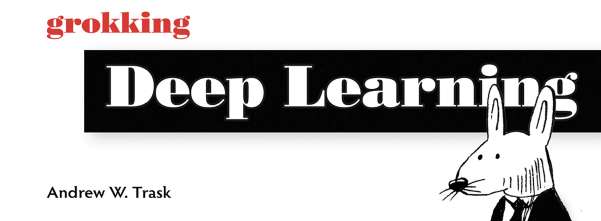

<!--

#################################################
### THIS FILE WAS AUTOGENERATED! DO NOT EDIT! ###
#################################################
# file to edit: index.ipynb
# command to build the docs after a change: nbdev_build_docs

-->

# Notebooks — Grokking Deep Learning by Andrew W. Trask

> https://www.manning.com/books/grokking-deep-learning

- Grokking Deep Learning was written to help **give you a foundation in deep learning** so that you can **master a major deep learning framework**.
   - Requires no math background beyond basic arithmetic.
   - Doesn't rely on a high-level library that might hide what's going on.
   - Anyone can read this book and understand how deep learning really works.
   - You won't just read the theory, you'll discover it yourself.
> (You can Buy the Book from [Manning Publications](https: //www.manning.com/books/grokking-deep-learning) or [Amazon](https://www.amazon.com/Grokking-Deep-Learning-Andrew-Trask/dp/1617293709)).

# Roadmap

"Grokking Deep Learning" has 16 Chapters:

1. Introducing Deep Learning: Why you should Learn It?
2. fundamental Concepts: How Do Machines Learn?
3. [Introduction to Neural Learning](https://akramz.github.io/grokking-deep-learning-notebooks/03.forward_propagation): Forward Propagation
4. [Introduction to Neural Learning](https://akramz.github.io/grokking-deep-learning-notebooks/04.gradient_descent): Gradient Descent
5. [Learning Multiple Weights at a Time](https://akramz.github.io/grokking-deep-learning-notebooks/05.Generalizing_GD): Generalizing Gradient Descent
6. [Building your first deep neural network](https://akramz.github.io/grokking-deep-learning-notebooks/06.Back_propagation): Introduction to Backpropagation
7. How to Picture Neural Networks: In your Head & on Paper
8. [Learning Signal & Ignoring Noise](https://akramz.github.io/grokking-deep-learning-notebooks/08.Regularization_Batching): Introduction to Regularization & Batching
9. [Modeling Probabilities & Non-Linearities](https://akramz.github.io/grokking-deep-learning-notebooks/09.Probabilities_Non-Linearities): Activation Functions
10. [Neural Learning about Edges & Corners](https://akramz.github.io/grokking-deep-learning-notebooks/10.Intro_to_CNNs): Introduction to Convolutional Neural Networks
11. [Neural Networks that Understand Language](https://akramz.github.io/grokking-deep-learning-notebooks/11.NNs_that_Understand_Language): King - Man + Woman == ?
12. [Neural Networks that write like Shakespeare](https://akramz.github.io/grokking-deep-learning-notebooks/12.RNNs): Recurrent Layers for Variable Length Data
13. [Introducing Automatic Optimization](https://akramz.github.io/grokking-deep-learning-notebooks/13.DL_framework): Let's build a deep learning framework
14. [Learning to Write like Shakespeare](https://akramz.github.io/grokking-deep-learning-notebooks/14.LSTMs_LM): Long Short-term Memory
15. Deep Learning on Unseen Data: Introducing Federated Learning
16. Where to Go from Here: A brief Guide

> Missing Notebooks are mostly based on original content from the Book.

---
